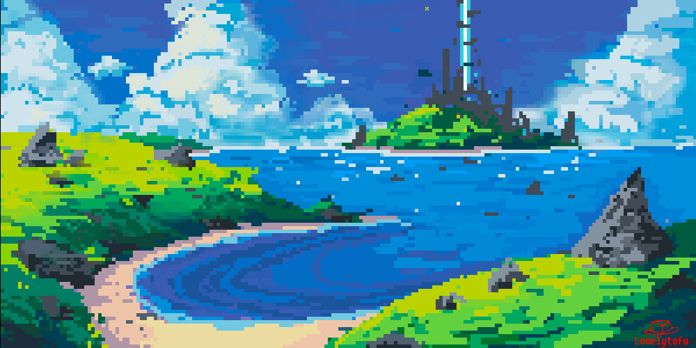

# Project Description 🦄

### What is the overall goal?
The goal of my project is to take an audio file( or just take the lyrics directly) and choose random lyrics from the song to generate an image to then turn that image into a piece of pixel art.

### Project Overview
Everyone loves to listen to music. Music is a beautiful thing because like a story or a painting everyone walks away with a different intrepretation. I wonder though what would be the interpretation of a machine. The goal of this project is to give the neural network a song and having it tokenize the audio to text, then taking that text and geenrating a pixelated version of that image. We will need to do image-image translation in order to make sure that the image that the neural network generates from the text gets pixelated. This approach is called "Neural Style Transfer". For the project we would also have to make use of a CycleGAN, which would allow us to train without paried examples. I am hopping to use the same approach as the authors of this article. In training the model with cartoon characters in a white background as domain A and pixelated cartoon characters on a white background for domain B. Here are some of the outcomes of their model.
 

For a more in depth reading of their approach read https://inikolaeva.medium.com/make-pixel-art-in-seconds-with-machine-learning-e1b1974ba572.

- Choosing random lyrics from a song and creating image based off of that.
- OR having the NN listen to the entire song and then generating an image.

### What is Pixel art?
Pixel art is a cool and unique art style. It is very simple, with each picel block working together to create a final piece of art.

## Project Goals
1. Transcribe Audio to Lyrics.
2. Randomly select lyrics. Generate image based off of the randomly selected lyrics.
3. Collect training data 
4. Pixelate that image

Side note: I also had an idea of feeding a neural network a whole bunch of free novel data and then training it to write a short story or poem about any song it is given. This was my inspo https://openai.com/blog/better-language-models/.

## Possible Ethical Implications
Some possible ethical implications are songs that have explicit lyrics or make use of lyrics that have slurs in them. The ethical implication comes into play with the kind of images that may be generated.

### Project Members
1. Kambe
2. Aldo 
3. Meelod 
4. Hasana 

## Related Works

## Works Cited
“Better Language Models and Their Implications.” OpenAI, 14 Feb. 2019, https://openai.com/blog/better-language-models/.

Chen, Tony. “Seeing Is Believing: Converting Audio Data into Images.” Medium, 23 Dec. 2020, https://towardsdatascience.com/seeing-is-believing-converting-audio-data-into-images-5ed1a2ca6647.

Nikolaeva, Irina. “Make Pixel Art in Seconds with Machine Learning.” Medium, 22 Sept. 2021, https://inikolaeva.medium.com/make-pixel-art-in-seconds-with-machine-learning-e1b1974ba572.

