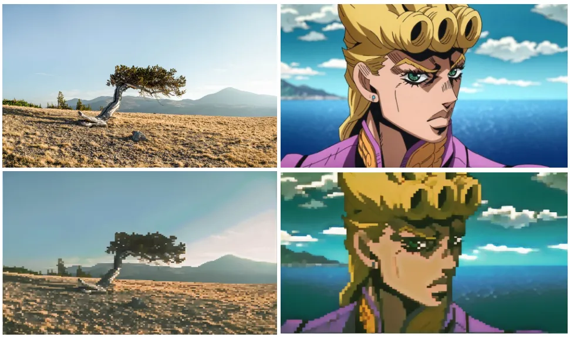
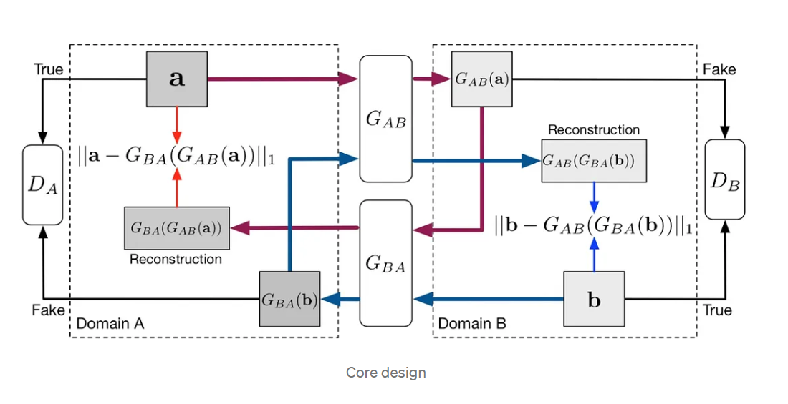
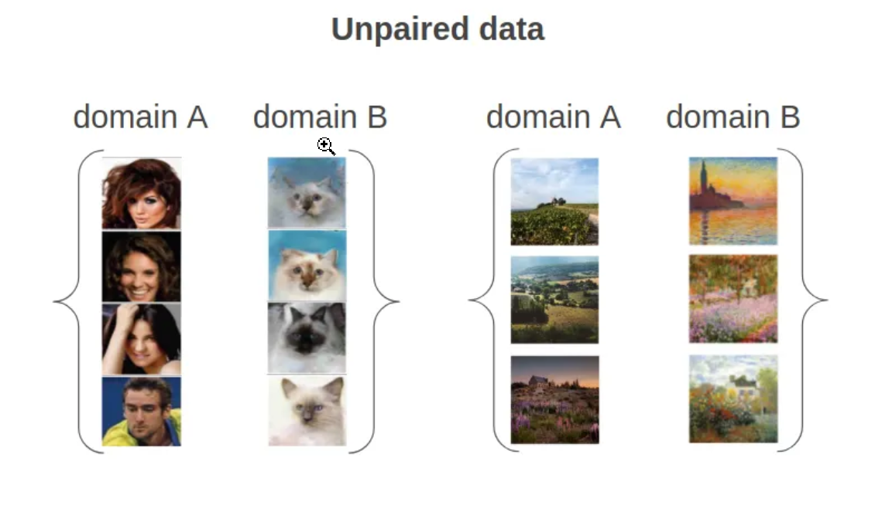

# Pixelate! Project Description 🦄

<figure>
    
</figure>

## **1. Introduction**
We are Team Pixelate! Our goal is to have a neural network generate an image based on text given in the form of lyrics, then take that image and pixelate it. We want to replicate the cognitive process of making images in our minds when we listen to music. Everyone loves to listen to music. Music is a beautiful thing because, like a story or a painting, everyone walks away with a different interpretation. Yet, how would a machine interpret the music and how can the machines' interpretation help to give the imagery of a sound that some people may not have the ability to listen to?

Our Team:
1. Kambe
2. Aldo
3. Meelod 
4. Hasana

Project Goals:
1. Transcribe Audio to Lyrics.
2. Randomly select lyrics. Generate image based off of the randomly selected lyrics.
3. Collect training data 
4. Pixelate that image

###   **1.1. What is Pixel Art?**
Pixel art is a cool and unique art style. It is very simple, with each pixel block working together to create a final piece of art. It is really popular nowadays due to its aesthetics and simplicity.
    
<figure>
    
</figure>
<figure>
    
    <figcaption> Image Source:
        <a href="https://inikolaeva.medium.com/make-pixel-art-in-seconds-with-machine-learning-e1b1974ba572 "> https://inikolaeva.medium.com/make-pixel-art-in-seconds-with-machine-learning-e1b1974ba572</a>

</figcaption>
</figure>

### **1.2 The Task At Hand?**
The applications of artificial intelligence (AI) within the arts are not a new concept. Artificial neural networks, which have previously been used in optimization, prediction analysis, and natural language processing, are being used to create various forms of art: visually or audibly. In particular to visual arts, past use cases for these neural networks have involved image recognition of certain elements or entire artwork, classification based on key aspects, prediction analysis on quality or aesthetics, and style transfer from one visual artwork to another [9]. Further developments within artificial intelligence in visual arts have allowed artificial neural networks to reconstruct their unique images through training and learning from examples of past artworks [1]. For our project, we would like to train a neural network to generate an image based on a wide selection of images that it will be trained on, and then to have that image converted into the style of pixel art.

 

Image Source:
https://inikolaeva.medium.com/make-pixel-art-in-seconds-with-machine-learning-e1b1974ba572

### **1.3. How Do We Differ?**
Our project is more focused on the current trend of using AI for art generation. Researchers like Eva Cetinic and her colleagues explore the current developing relationship between artificial intelligence and art in our modern world [2]. Specifically, they question some ethical implications that come with the process of AI art generation such as asking if we should even use AI for the art generation, what the creative process behind AI art is and the credibility and copyright issues that come along the process of developing art. Furthermore, Chen and colleagues continue to explore the benefits and complexities behind artists using artificial intelligence as a tool. They mention that while artists may be able to alleviate the laborious process of artistic creation to make room to maximize their creative expressions, AI art may lead to further issues in the future including plagiarism  [3]. Therefore, our objective will be to analyze these implications through our project and extend the applications of artificial intelligence to pixelate the lyrics of songs.

## **2. Our Approach**
Our project will have two separate steps. First, we will be generating an image based on a text prompt. This is similar to the process of Dall-E and the numerous programs that have come after (ex: Craiyon, a free version of Dall-E created by engineer Boris Dayma [5]). We will also be using the inspiration of other models, such as Dall-E 2 and Imagen, and tutorials to replicate the text-to-image generation process. [6]. Our goal is not only to replicate the process through this step but also to make it more efficient and implement pixelation based on music lyrics. In our second step, we will be pixelating our generated image, transforming it into pixel art. Programs to pixelate images have been around for years, with many popular programs using CycleGAN [7]. Still, there can be many issues with generating pixel art, specifically with the blurriness of images and sprite generation for pixelated characters [4].

Image Source:
https://inikolaeva.medium.com/make-pixel-art-in-seconds-with-machine-learning-e1b1974ba572

### **2.1. The Data**
For our project there will be two things we have to train the neural network one, generating images from text and converting images to pixelated art images. For this we must have distinct data sets for each separate goal. Our data set for image generation based on text would consist of a host of labeled images. Our data set for image-image generation would have to consists of unpaired data in order to facilitate the neural networks learning on how to turn an image into a pixelated version of itself. (Need to expand on this more)

Image Source:
https://inikolaeva.medium.com/make-pixel-art-in-seconds-with-machine-learning-e1b1974ba572

## **3. Ethics and Our Why?**
Why Pixelate? Pixelate will be a fun and cool feature to add to any streaming site as well as a nice feature for people that are deaf and hard of hearing. But there are many ethical implications when it comes to how art is being utilized by AI. A non-ML approach alternative to our project could include where certain keywords and phrases can show pre-made images. For example, a keyword regarding ducks could show a pre-created image of a duck. While this could prove to be a valid alternative, the issue would rely on not making the image-creation process dynamic and tailored for the lyrics. For example, the song lyric could talk about ducks in space, but since no image of that exists, it would resort to using the next closest image.

Our process to handle appeals and mistakes will take each claim seriously and address any parties that could have been harmed due to anything we have created. Our team is very diverse not only in race, but in the background, and skill set helping us to get a variety of inputs to avoid as much error as possible. Our data (i.e. song lyrics) is valid for its intended use. Some bias in our data could be what the image corresponds to. We hope to minimize bias in our data in the model by looking through the dataset we decide to use and ensuring that there are no images that push a certain narrative or stereotypes. We can audit our data to ensure that the lyrics that we are using to create the pixelated images are clean so that we avoid situations where the AI creates graphical images. We can audit our code so that we have checkers in place so that any graphical and unclean lyrics are not used when creating the images.

Some misinterpretations of the results could include slang words in lyrics, which had another meaning than what it was intended to mean in the song. Thereby, this could cause the created pixelate image to be something not related to the song lyrics. We might impinge individuals' privacy or anonymity if we happen to use a data set in which people are placed without their permission.

## **4. Methodology**
There are two separate processes that we need to train our neural network to do. First text-image and then image-image. We will first train our neural network to transform the text into an image. We will do that by using diffusion.

### **4.1. Text-Image Section**
#### What is diffusion?
Diffusion models are a type of generative model that can create new data using the training data. The process through which it functions is that it begins by eradicating the training data using additional noise. It then proceeds to reverse the precedent procedure, which allows it to recover the data and learn to generate those images. The diffusion model applies this process to random parts in the images, and inputs like text can help improve the process.

#### Why diffusion?
In our project, we will use diffusion when transforming our text input into images. Diffusion is our preferred method due to its versatility in handling different types of inputs, for which we will use song lyrics in our project. With the text input, we will stably generate more realistic pictures, and our result will give us images to pixelate for our next step.

#### Our Dataset
For our dataset, we will pull a sample of popular songs and use COCO (Common Objects in Context) to test our model. COCO is an object detection and captioning dataset that identifies objects in images and will help us in training our diffusion model to ensure it is as accurate as possible in creating the images. However, the limitation to using COCO is that it only works for certain objects and not emotionally charged vocabulary. To train our model and test for emotions, we also will use ImageNet, which is an image dataset with 14 million images that are human-annotated.

#### Software we are using
For our software, we will use Visual Studio Code and code in PyTorch.

### **4.2. Image-Image Section**
This process was made with the help of https://inikolaeva.medium.com/make-pixel-art-in-seconds-with-machine-learning-e1b1974ba572

For the second part of our project the image-image translation we will use Cycle-GANS (Generative Adversarial Network) Neural style transfer, using machine learning models to solve image-to-image translation.

#### What is a GAN?
The GAN architecture has two models: a generator that creates realistic-looking images, and a discriminator that distinguishes between real and fake images. The discriminator is trained directly, while the generator is updated through the discriminator. This creates an adversarial process where the generator tries to trick the discriminator, while the discriminator tries to correctly identify fake images. In this way, both models are trained at the same time.

#### Why Cycle GANS?
CycleGAN is a type of model that can train image-to-image translation models without paired examples, meaning it can convert images from one domain to another without requiring matching examples. This enables the model to translate images back and forth between different domains. The models undergo unsupervised training by using a set of images from both the source and target domains, which don't necessarily have any direct connection or relationship between them.

#### Our Dataset
For our data, we will use a dataset prepared by the computer scientist in the article 
https://drive.google.com/file/d/1qDXB5g0Cb0VwISXwnfeiehPHuTgxWhdG/view. This data set consists of paired images
Link with 22 image datasets: https://imerit.net/blog/22-free-image-datasets-for-computer-vision-all-pbm/
https://www.image-net.org/about.php.

#### Software we are using
We will use PyTorch as a neural network framework, and PyCharm IDE for a training model with GPU. We will also use jupyter notebook for analysis and show results.

## **5. Discussion**
We will be using a data set from an article we found that contains images of cartoon characters with white backgrounds for domain A. As well as images of pixelated character characters with white backgrounds for domain B. We trained 2 neural networks, the first was for text-image generation which was pre-trained, and the second is an image-image neural network. We will be implementing two types of networks, [name]  for image generation and [name] for image pixelation.

While the software for image generation and image pixelation already exists separately, our project’s goal is to combine both of these processes to output an AI-generated pixel image.

## **6. Reflections**
Throughout our project, most of our time was spent researching different methods, learning more about the various techniques in translating the song lyrics to images, then pixelating those images: text to image then image to image. Given the opportunity to work on this next time, we would spend less time researching the many different neural networks.

Future work can be done to implement features that can produce several images per second of the song lyrics and play it out as a sequence on video—similar to a natural music video. The idea is that each subsequent image is a slight change from the previous so that it appears to be a single video playing in linear time.

## **7. References**
[1] Artificial Neural Networks and Paintings: What Is Neural Art?” ARTDEX, 14 May 2021, [https://www.artdex.com/ann-artificial-neural-networks-paintings-neural-art/](https://www.artdex.com/ann-artificial-neural-networks-paintings-neural-art/). 

[2] Cetinic, Eva, and James She. “Understanding and Creating Art with AI: Review and Outlook.” ACM Transactions on Multimedia Computing, Communications, and Applications, vol. 18, no. 2, Feb. 2022, p. 66:1-66:22. May 2022, [https://doi.org/10.1145/3475799](https://doi.org/10.1145/3475799).

[3] Chen, Weiwen, et al. “A Methodological Approach to Create Interactive Art in Artificial Intelligence.” HCI International 2020 – Late Breaking Papers: Cognition, Learning and Games, edited by Constantine Stephanidis et al., Springer International Publishing, 2020, pp. 13–31. Springer Link, [https://doi.org/10.1007/978-3-030-60128-7_2](https://doi.org/10.1007/978-3-030-60128-7_2).

[4] Coutinho, Flávio, and Luiz Chaimowicz. “On the Challenges of Generating Pixel Art Character Sprites Using GANs.” Proceedings of the AAAI Conference on Artificial Intelligence and Interactive Digital Entertainment, vol. 18, no. 1, 1, Oct. 2022, pp. 87–94. ojs.aaai.org, [https://doi.org/10.1609/aiide.v18i1.21951](https://doi.org/10.1609/aiide.v18i1.21951).

[5] How the Author of DALL-E Mini Created the Ultimate Meme Maker — and a New Era for AI. [https://www.inverse.com/innovation/dall-e-mini-creator](https://www.inverse.com/innovation/dall-e-mini-creator). Accessed 14 Feb. 2023.

[6] “MinImagen - Build Your Own Imagen Text-to-Image Model.” News, Tutorials, AI Research, 17 Aug. 2022, [https://www.assemblyai.com/blog/minimagen-build-your-own-imagen-text-to-image-model/](https://www.assemblyai.com/blog/minimagen-build-your-own-imagen-text-to-image-model/).

[7] Nikolaeva, Irina. “Make Pixel Art in Seconds with Machine Learning.” Medium, 22 Sept. 2021, [https://inikolaeva.medium.com/make-pixel-art-in-seconds-with-machine-learning-e1b1974ba572](https://inikolaeva.medium.com/make-pixel-art-in-seconds-with-machine-learning-e1b1974ba572).

[8] “Point-E: How OpenAI’s Dall-E Successor Uses AI to Sculpt Your 3D Dreams.” BBC Science Focus Magazine, [https://www.sciencefocus.com/future-technology/point-e/](https://www.sciencefocus.com/future-technology/point-e/). Accessed 14 Feb. 2023.

[9] Santos, Iria, et al. “Artificial Neural Networks and Deep Learning in the Visual Arts: A Review.” Neural Computing and Applications, vol. 33, no. 1, Jan. 2021, pp. 121–57. Springer Link, [https://www.sciencefocus.com/future-technology/point-e/](https://doi.org/10.1007/s00521-020-05565-4).
